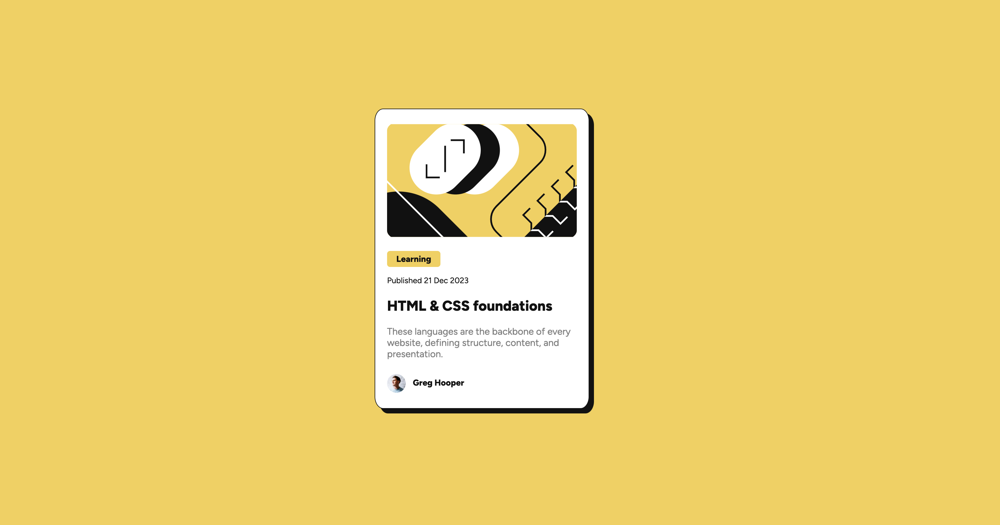
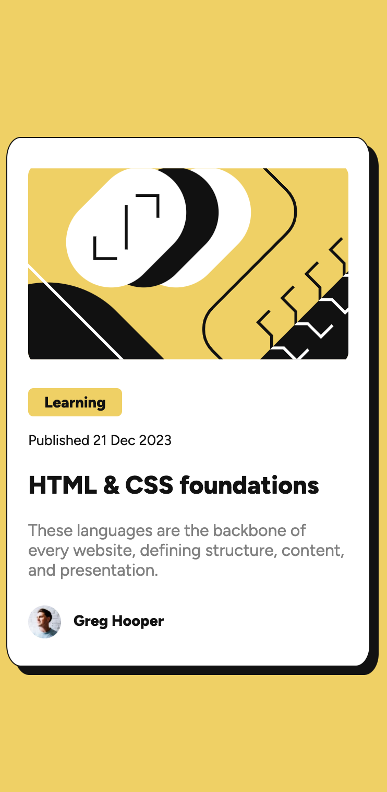

# Frontend Mentor - Blog preview card solution

This is a solution to the [Blog preview card challenge on Frontend Mentor](https://www.frontendmentor.io/challenges/blog-preview-card-ckPaj01IcS). 

## Table of contents

- [Overview](#overview)
  - [The challenge](#the-challenge)
  - [Screenshot](#screenshot)
  - [Links](#links)
- [My process](#my-process)
  - [Built with](#built-with)
  - [What I learned](#what-i-learned)
- [Author](#author)

## Overview

### The challenge

Users should be able to:

- See hover and focus states for all interactive elements on the page

### Screenshot

### Links

- Solution URL: [Solution URL here](https://github.com/BKFOE/Blog-Preview-Card.git)
- Live Site URL: [Live site URL here](https://bkfoe.github.io/Blog-Preview-Card/)

## My process

### Built with

- Semantic HTML5 markup
- CSS custom properties
- Flexbox

### What I learned

Tried to lean in on this challenge and not use media queries to manage the responsiveness. I think I was able to acheive that but there are small parts that I needed to code into specific classes. I am still exploring what's the best way to make designs responsive without coding each individual element. 

## Author

- Website - [BKFOE](https://github.com/BKFOE)
- Frontend Mentor - [@bkfoe](https://www.frontendmentor.io/profile/bkfoe)
